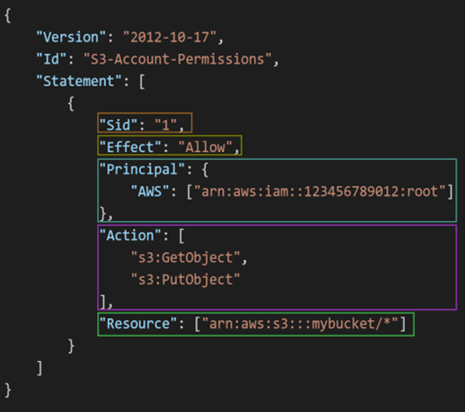

AWS Identity and Access Management(IAM)
IAM: Users & Groups
IAM = Identity and Access Management, Global service
Root account created by default, shouldn’t be used or shared
Users are people within your organization, and can be grouped
Groups only contain users, not other groups
Users don’t have to belong to a group, and user can belong to multiple groups

IAM: Permissions
Users or Groups can be assigned JSON documents called policies
These policies define the permissions of the users 
In AWS you apply the least privilege principle: don’t give more permissions than a user needs

IAM Policies Structure
Consists of
Version: policy language version
Id: an identifier for the policy (optional)
Statement: one or more individual statements (required)
Statements consists of
Sid: an identifier for the statement (optional)
Effect: whether the statement allows or denies access (Allow, Deny)
Principal: account/user/role to which this policy applied to
Action: list of actions this policy allows or denies 
Resource: list of resources to which the actions applied to
Condition: conditions for when this policy is in effect 

IAM – Password Policy
Strong passwords = higher security for your account
In AWS, you can setup a password policy:
Set a minimum password length
Require specific character types:
including uppercase letters, lowercase letters, Numbers, non-alphanumeric characters
Allow all IAM users to change their own passwords
Require users to change their password after some time (password expiration)
Prevent password re-use

Multi Factor Authentication - MFA
Users have access to your account and can possibly change configurations or delete resources in your AWS account
You want to protect your Root Accounts and IAM users
MFA = password you know + security device you own
Main benefit of MFA: 
if a password is stolen or hacked, the account is not compromised

How can user acces AWS?
To access AWS, you have three options:
AWS Management Console (protected by password + MFA)
AWS Command Line Interface (CLI): protected by access keys
AWS Software Developer Kit (SDK) - for code: protected by access keys
Access Keys are generated through the AWS Console
Users manage their own access keys
Access Keys are secret, just like a password. Don’t share them
Access Key ID ~= username
Secret Access Key ~= password

AWS Command Line Interface(CLI)
A tool that enables you to interact with AWS services using commands in your command-line shell
Direct access to the public APIs of AWS services
You can develop scripts to manage your resources
It’s open-source https://github.com/aws/aws-cli
Alternative to using AWS Management Console

AWS Software Development Kit (AWS SDK)
Language-specific APIs (set of libraries) 
Enables you to access and manage AWS services programmatically
Embedded within your application
Supports
SDKs (JavaScript, Python, PHP, .NET, Ruby, Java, Go, Node.js, C++)
Mobile SDKs (Android, iOS, …)
IoT Device SDKs (Embedded C, Arduino, …)
Example: AWS CLI is built on AWS SDK for Python

IAM roles
Some AWS service will need to perform actions on your behalf
To do so, we will assign permissions to AWS services with IAM Roles
Common roles: 
EC2 Instance Roles
Lambda Function Roles
Roles for CloudFormation 

IAM Security tools
IAM Credentials Report (account-level)
a report that lists all your account's users and the status of their various credentials

IAM Access Advisor (user-level)
Access advisor shows the service permissions granted to a user and when those services were last accessed.
You can use this information to revise your policies

IAM Guidlines and best practice
Don’t use the root account except for AWS account setup
One physical user = One AWS user
Assign users to groups and assign permissions to groups
Create a strong password policy
Use and enforce the use of Multi Factor Authentication (MFA)
Create and use Roles for giving permissions to AWS services
Use Access Keys for Programmatic Access (CLI / SDK)
Audit permissions of your account using IAM Credentials Report & IAM Access Advisor
Never share IAM users & Access Keys

Summary
Users: mapped to a physical user, has a password for AWS Console
Groups: contains users only 
Policies: JSON document that outlines permissions for users or groups
Roles: for EC2 instances or AWS services
Security: MFA + Password Policy
AWS CLI: manage your AWS services using the command-line
AWS SDK: manage your AWS services using a programming language
Access Keys: access AWS using the CLI or SDK
Audit: IAM Credential Reports & IAM Access Advisor
