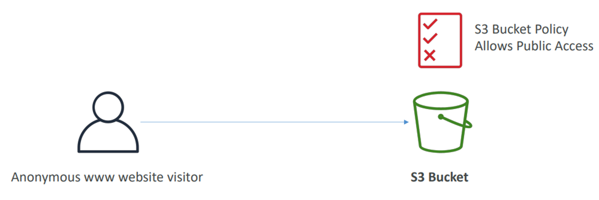
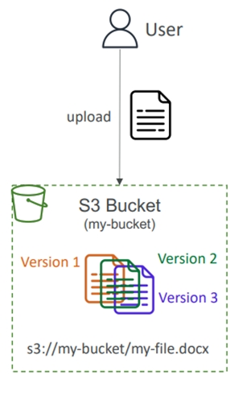
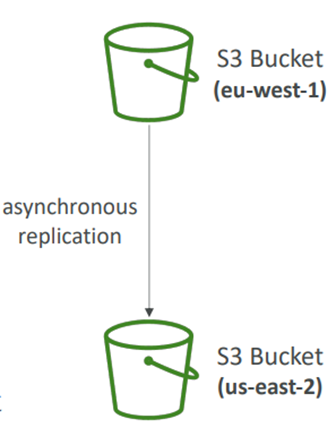

S3 intro

Amazon S3 is one of the main building blocks of AWS
It’s advertised as ”infinitely scaling” storage 
Many websites use Amazon S3 as a backbone
Many AWS services use Amazon S3 as an integration as well

Use Cases
Backup and storage
Disaster Recovery
Archive
Hybrid Cloud storage
Application hosting
Media hosting
Data lakes & big data analytics
Software delivery
Static website

S3: Bucket
Amazon S3 allows people to store objects (files) in “buckets” (directories)
Buckets must have a globally unique name (across all regions all accounts)
Buckets are defined at the region level 
S3 looks like a global service but buckets are created in a region
Naming convention
No uppercase, No underscore
3-63 characters long
Not an IP
Must start with lowercase letter or number
Must NOT start with the prefix xn--
Must NOT end with the suffix -s3alias

S3: object
Objects (files) have a Key
The key is the FULL path:
s3://my-bucket/my_file.txt
s3://my-bucket/my_folder1/another_folder/my_file.txt
The key is composed of prefix + object name
s3://my-bucket/my_folder1/another_folder/my_file.txt
There’s no concept of “directories” within buckets (although the UI will trick you to think otherwise)
Just keys with very long names that contain slashes (“/”)
Object values are the content of the body:
Max. Object Size is 5TB (5000GB)
If uploading more than 5GB, must use “multi-part upload”
Metadata (list of text key / value pairs – system or user metadata)
Tags (Unicode key / value pair – up to 10) – useful for security / lifecycle
Version ID (if versioning is enabled)

S3: security
User-Based
IAM Policies – which API calls should be allowed for a specific user from IAM
Resource-Based
Bucket Policies – bucket wide rules from the S3 console - allows cross account
Object Access Control List (ACL) – finer grain (can be disabled)
Bucket Access Control List (ACL) – less common (can be disabled)
Note: an IAM principal can access an S3 object if
The user IAM permissions ALLOW it OR the resource policy ALLOWS it
AND there’s no explicit DENY
Encryption: encrypt objects in Amazon S3 using encryption keys

S3: bucket policies
JSON based policies
Resources: buckets and objects
Effect: Allow / Deny
Actions: Set of API to Allow or Deny
Principal: The account or user to apply the policy to
Use S3 bucket for policy to:
Grant public access to the bucket
Force objects to be encrypted at upload
Grant access to another account (Cross Account)

Bucket setting for Block public access
These settings were created to prevent company data leaks
If you know your bucket should never be public, leave these on
Can be set at the account level

satic websie hosting

S3 can host static websites and have them accessible on the Internet
The website URL will be (depending on the region)
http://bucket-name.s3-website-aws-region.amazonaws.com
OR
http://bucket-name.s3-website.aws-region.amazonaws.com
If you get a 403 Forbidden error, make sure the bucket policy allows public reads!

S3: versioning

You can version your files in Amazon S3
It is enabled at the bucket level
Same key overwrite will change the “version”: 1, 2, 3….
It is best practice to version your buckets
Protect against unintended deletes (ability to restore a version)
Easy roll back to previous version 
Notes:
Any file that is not versioned prior to enabling versioning will have version “null”
Suspending versioning doesn’t delete the previous versions

S3: Replication
Must enable Versioning in source and destination buckets
Cross-Region Replication (CRR)
Same-Region Replication (SRR)
Buckets can be in different AWS accounts
Copying is asynchronous
Must give proper IAM permissions to S3
Use cases:
CRR – compliance, lower latency access, replication across accounts
SRR – log aggregation, live replication between production and test

After you enable Replication, only new objects are replicated
Optionally, you can replicate existing objects using S3 Batch Replication
Replicates existing objects and objects that failed replication
For DELETE operations
Can replicate delete markers from source to target (optional setting)
Deletions with a version ID are not replicated (to avoid malicious deletes)
There is no “chaining” of replication
If bucket 1 has replication into bucket 2, which has replication into bucket 3
Then objects created in bucket 1 are not replicated to bucket 3
